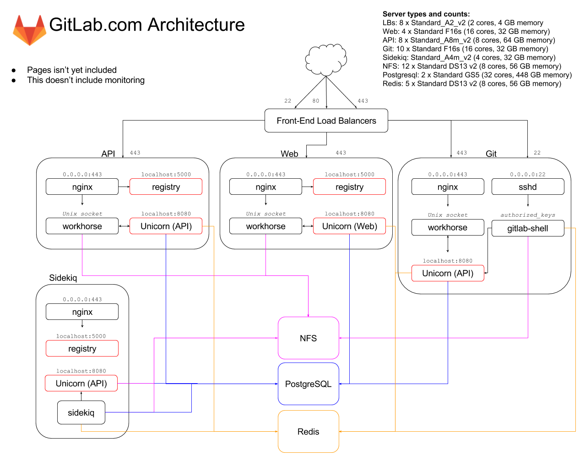

# Production Architecture

Our core infrastructure is currently hosted on several cloud providers,
all with different functions. This document does not cover servers that
are not integral to the public facing operations of GitLab.com.

This is what it looks like:

[Source](https://docs.google.com/drawings/d/1MqoemFRdoLm3_p5aKBhzblZM872F1R-tWdoOR5xMQpE/edit), GitLab internal use only

## Azure

The main portion of GitLab.com is hosted on Microsoft Azure. We have
the following servers there.

* 5 HAProxy load balancers for GitLab.com
* 2 HAProxy load balancers for GitLab Pages
* 2 HAProxy nodes for altssh.GitLab.com
* 22 front-end nodes of which:
  * 4 are Web nodes
  * 8 are API nodes
  * 10 are Git nodes
* 10 Sidekiq nodes
* 4 PostgreSQL servers
* 5 Redis servers
* 3 Prometheus servers
* 11 NFS servers

Note that these numbers can fluctuate to adapt to the platform needs.

We also use availability sets to ensure that a minimum number of servers in each
group are available at any given time. This ensures that Azure will not reboot
all instances in the same availability set at the same time for anything that
is planned.

All our servers run the latest Ubuntu LTS unless there is a specific need to do otherwise. Every server is configured with a fully fledged set of firewall rules for increased security.

### Load Balancers

We utilize Azure load balancers in front of our HAProxy nodes. This allows us to leverage on the Azure infrastructure for HA as well as [taking advantage of the power of HAProxy](https://gitlab.com/gitlab-cookbooks/gitlab-haproxy).

Additionally, we utilize an Azure load balancer to manage PostgreSQL failovers.

* The GitLab.com load balancer pool serves git over ssh, git over https, http and https traffic.
* The GitLab Pages load balancer serves http and https.
* The AltSSH load balancer serves [git on port 443](https://about.gitlab.com/2016/02/18/gitlab-dot-com-now-supports-an-alternate-git-plus-ssh-port/) and translates it to port 22 on the back-end.

### Service nodes

Different services have different resource utilization patterns so we use a variety of instance types across our service nodes that are consistent for each group. We have recently isolated traffic by type on dedicated pools of nodes. We hope you noticed the performance improvement.

## Digital Ocean

Digital Ocean houses several servers that do not need to directly interact
with our main infrastructure. There are many of these that do a variety of
things, however not all will be listed here.

The primary things on Digital Ocean at this time are:

* Chef Configuration Management Servers
* Blackbox monitoring servers
* Shared runner managers
* Runner cache servers
* ELK servers

## AWS

We host our DNS with route53 and we have several EC2 instances for various
purposes. The servers you will interact with most are listed Below

* Version
* Mattermost
* License

## Google Cloud

We are currently investigating Google Cloud.

# Technology at GitLab

We use a lot of cool ([but boring](https://about.gitlab.com/handbook/#values))
technologies here at GitLab. Below is a non-exhaustive list of tech we use here.

* [Ruby](https://www.ruby-lang.org/) (probably goes without saying)
* [Chef](https://www.chef.io/chef/)
* [Prometheus](https://prometheus.io/)
* [PostgreSQL](https://www.postgresql.org/)
* [Redis](https://redis.io/)
* [ELK Stack](https://www.elastic.co/products)
* [Terraform](https://www.terraform.io)
* [Consul](https://www.consul.io)
